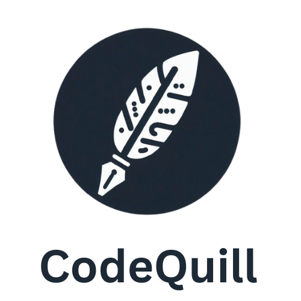
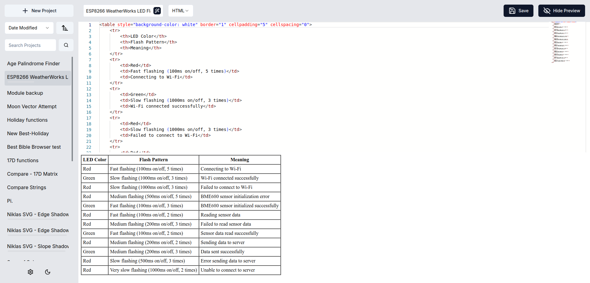

# CodeQuill

[](https://github.com/codingwithkid/codequill)
[](https://crowdin.com/project/codequill)

<!-- [](https://github.com/The-Best-Codes/codequill) -->





## How to install CodeQuill on Linux

Installing CodeQuill on Linux (Ubuntu is preferred) is straightforward.

### Using the installer

Open your terminal (you can usually press CTRL + ALT + T to do this) and paste the following command:

```bash
cd ~ && curl -O https://raw.githubusercontent.com/The-Best-Codes/codequill/refs/heads/main/codequill_app.sh && bash codequill_app.sh
```

The install should happen automatically.

### Manual installation

1. Open a terminal on your device.

2. Navigate to your home directory:

   ```
   cd ~
   ```

3. Download the installation script using curl:

   ```
   curl -O https://raw.githubusercontent.com/The-Best-Codes/codequill/main/.device_scripts/codequill.sh
   ```

4. Make the downloaded script executable:

   ```
   chmod +x codequill.sh
   ```

5. Run the installation script:

   ```
   ./codequill.sh
   ```

6. Wait for the installation process to complete. The script will install CodeQuill and any necessary dependencies.

7. Once the installation is finished, you should be able to use CodeQuill on your device.

---

CodeQuill is a web-based code editor designed to offer a free, easy, and efficient way to organize, store, edit, and share code snippets directly from your device. Whether you're working on personal projects or simply storing snippets for future reference, CodeQuill provides a seamless experience for managing your code.

## Features

- **Syntax Highlighting:** Enjoy coding with syntax highlighting that supports multiple languages.
- **Code Storage:** Save your snippets in the a local database for easy access anywhere on your network.
- **Share**: Share your code snippets with other devices on your network to easily transfer codes.
- **Comfortable Interface:** The editor is designed to be as intuitive and familiar as possible. The experience should remind you of working in VS Code.
- **AI Support:** CodeQuill uses AI models to help you name your projects, translate them (coming soon), generate code (coming soon), and much more.

### AI Project Name Generator


To generate a name for your project, simply click the wand icon in the project name input. By default, the llama-70b model is used to name your project. You can customize this and other behaviors such as the base URL, API key, and more in by creating a `.env` file in the project root.

## Getting Started

### Prerequisites

- Node.js installed on your machine
- A modern web browser

### Installation

1. Clone the repository to your local machine:

   ```bash
   git clone https://github.com/The-Best-Codes/codequill.git
   cd codequill
   ```

2. Install the required dependencies:

   ```bash
   npm install
   ```

3. Initialize the database:

   ```bash
   node scripts/init-db.js
   ```

4. Start the development server:

   ```bash
   npm run dev
   ```

5. Access the CodeQuill interface by opening `http://localhost:3000` in your web browser.

### Building for Production

To deploy CodeQuill for production use:

```bash
npm run build && npm start
```

This command builds the application for optimal performance and starts the production server.

## Contributing

We welcome contributions to CodeQuill! Whether you're looking to fix bugs, add new features, or improve documentation, please feel free to submit a pull request.

## License

CodeQuill is released under the MIT License. See the LICENSE file for more details.

## Support

For support or to report issues, please visit the [issues page](https://github.com/The-Best-Codes/codequill/issues).

Thank you for considering CodeQuill for your coding needs!
