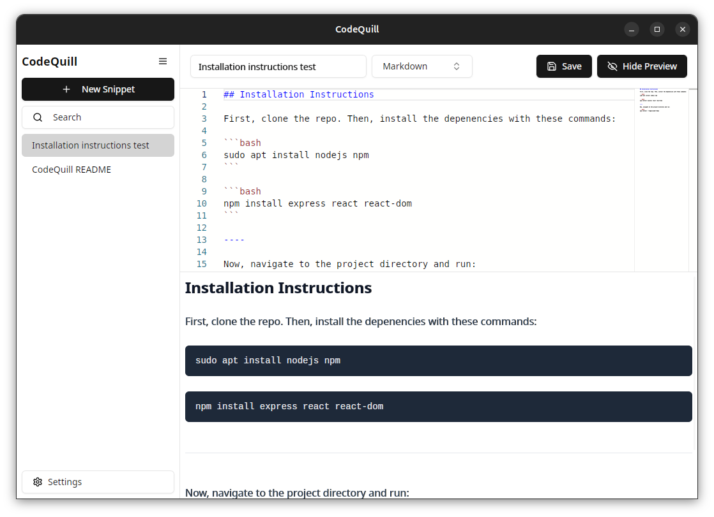
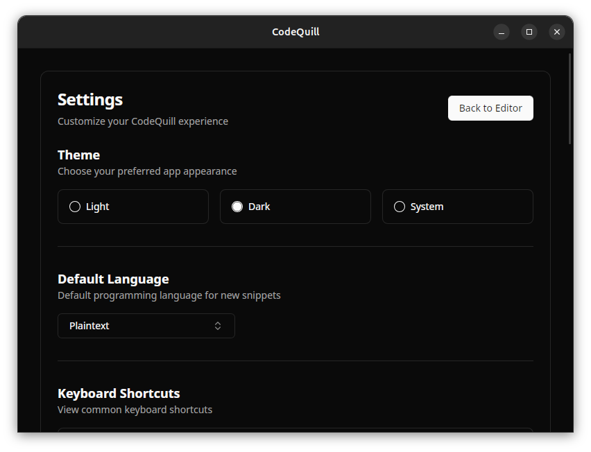

# CodeQuill

_Organize, edit, and preview code efficiently._



[](https://snapcraft.io/codequill)

Built with Tauri 2, CodeQuill offers a rich editing experience with syntax highlighting for over 90 programming languages and built-in previews for Markdown and HTML.
Whether you're a seasoned developer or just starting out, CodeQuill helps you organize, edit, and preview your code with ease.

---

## Table of Contents

- [Installation](#installation)
  - [Prerequisites](#prerequisites)
  - [Platform-Specific Installation](#platform-specific-installation)
    - [Linux](#linux)
    - [Windows](#windows)
    - [macOS](#macos)
  - [Snap Store (Coming Soon)](#snap-store-coming-soon)
  - [Flathub (Coming Soon)](#flathub-coming-soon)
- [Updating](#updating)
  - [Linux (Debian-based)](#linux-debian-based)
- [Migrating from CodeQuill v1](#migrating-from-codequill-v1)
- [Usage](#usage)
  - [Key Features](#key-features)
    - [Rich Text Editor](#rich-text-editor)
    - [Syntax Highlighting](#syntax-Highlighting)
    - [Built-in Previews](#built-in-previews)
- [Contributing](#contributing)
  - [Getting Started](#getting-started)
  - [Development Setup](#development-setup)
  - [Dependencies](#dependencies)
  - [Coding Style](#coding-style)
- [License](#license)

---

## Installation

### Prerequisites

Before installing CodeQuill, ensure you have the necessary prerequisites installed on your system. These may include:

- A modern operating system (Windows 8+, macOS 10.13+, or a recent Linux distribution). While CodeQuill aims for cross-platform compatibility, Windows 7 may not be fully supported.
- Sufficient system resources (RAM and storage) to run a desktop application.

### Platform-Specific Installation

Choose the installation method that best suits your operating system.

#### Linux

1.  Download the latest `.deb` package from the [Releases](https://github.com/The-Best-Codes/codequill/releases) page.
2.  Open a terminal and navigate to the directory where you downloaded the package.
3.  Install the package using `dpkg`:

    ```bash
    sudo dpkg -i codequill_<version>_<architecture>.deb
    ```

    Replace `<version>` and `<architecture>` with the actual values from the filename.

4.  If you encounter dependency issues, run:

    ```bash
    sudo apt-get install -f
    ```

#### Windows

There are usually both `.msi` and `.exe` installers available for Windows. Both should be compatible with most Windows versions.

1.  Download the latest `.msi` or `.exe` installer from the [Releases](https://github.com/The-Best-Codes/codequill/releases) page.
2.  Double-click the downloaded file and follow the on-screen instructions.

#### macOS

1.  Download the latest `.dmg` file from the [Releases](https://github.com/The-Best-Codes/codequill/releases) page.
2.  Double-click the downloaded file and drag the CodeQuill icon to your Applications folder.

### Snap Store

[](https://snapcraft.io/codequill)

CodeQuill is now available on the Snap Store!

Search 'codequill' in the Snap Store and click 'Install', or run the following command in a terminal:

```bash
sudo snap install codequill
```

### Flathub (Coming Soon)

CodeQuill will soon be available on Flathub. Check back later for installation instructions.

---

## Updating

### Linux (Debian-based)

1.  Download the latest `.deb` package from the [Releases](https://github.com/The-Best-Codes/codequill/releases) page.
2.  Open a terminal and navigate to the directory where you downloaded the package.
3.  Upgrade the package using `dpkg`:

    ```bash
    sudo dpkg -i codequill_<version>_<architecture>.deb
    ```

    This will install the new version while preserving your settings.

---

## Migrating from CodeQuill v1

All CodeQuill v1 releases are not compatible with CodeQuill v2.
You should uninstall CodeQuill v1 before installing CodeQuill v2.
You can do so by running the `codequill.sh` script (or right-clicking on the app icon, then selecting `CodeQuill Manager`), then choosing the "Uninstall" option.

You may want to back up the old database or your currently saved snippets before uninstalling.
There is currently no way except a manual migration to transfer your data to CodeQuill v2, though we may provide a migration tool in the future.
You can likely find your data for the old application in `~/codequill/`.

---

## Usage

Usage is quite straightforward. After launching CodeQuill, you can click the "New Snippet" button to create your first snippet.
I'd also recommend checking out settings and search to familiarize yourself with the app.



### Key Features

CodeQuill is designed to be intuitive and powerful. Here are some of its key features:

#### Rich Text Editor

CodeQuill's core is a fully-featured text editor, Monaco, providing a smooth and responsive coding experience.

#### Syntax Highlighting

Enjoy syntax highlighting for over 90 programming languages, making your code easier to read and understand.

#### Built-in Previews

Quickly preview your Markdown and HTML files directly within CodeQuill. Preview panes update live for easy testing and debugging.

---

## Contributing

We welcome contributions from the community! Here's how you can get involved:

### Getting Started

1.  Fork the repository on [GitHub](https://github.com/The-Best-Codes/codequill).
2.  Clone your forked repository to your local machine:

    ```bash
    git clone https://github.com/<your-username>/codequill.git
    ```

3.  Create a new branch for your feature or bug fix:

    ```bash
    git checkout -b feature/your-feature-name
    ```

### Development Setup

Before performing the following steps, ensure you have installed the Tauri 2 prerequisites.
You can find out more on the [Tauri website](https://v2.tauri.app/start/prerequisites/).

1.  Install Node.js and npm if you haven't already. It's recommended to use the latest LTS version of Node.js.
2.  Navigate to the project directory in your terminal.
3.  Install the project dependencies:

    ```bash
    npm install
    ```

4.  Start the development server:

    ```bash
    npm run tauri dev
    ```

### Dependencies

CodeQuill relies on the following major dependencies:

- **Tauri 2:** The framework for building cross-platform desktop applications.
- **React:** A JavaScript library for building user interfaces.
- **Tailwind CSS:** A utility-first CSS framework.
- **Shadcn UI:** A collection of accessible and reusable UI components built with Radix UI and Tailwind CSS.

### Coding Style

While we don't enforce strict coding style guidelines, we encourage you to follow these recommendations:

- Don't format files that you haven't modified. This is low effort and can lead to a more cluttered PR review process.
- Write clear and concise code.
- Add comments to explain complex logic. Your comments may be removed later.

---

## License

CodeQuill is released under the [MIT License](LICENSE).
